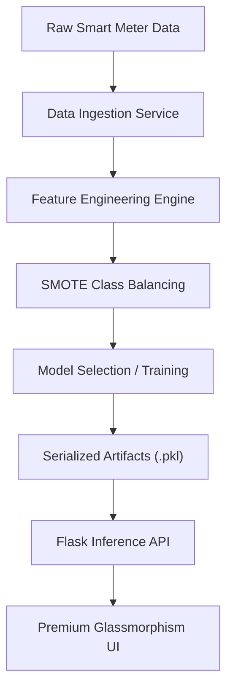
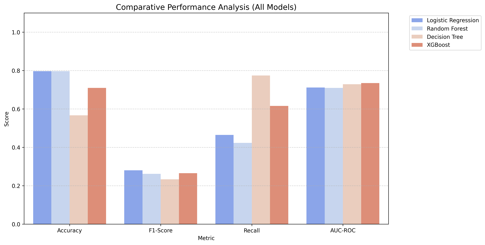
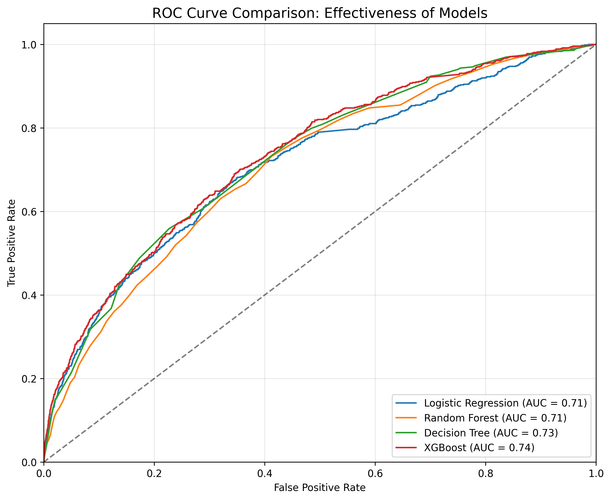
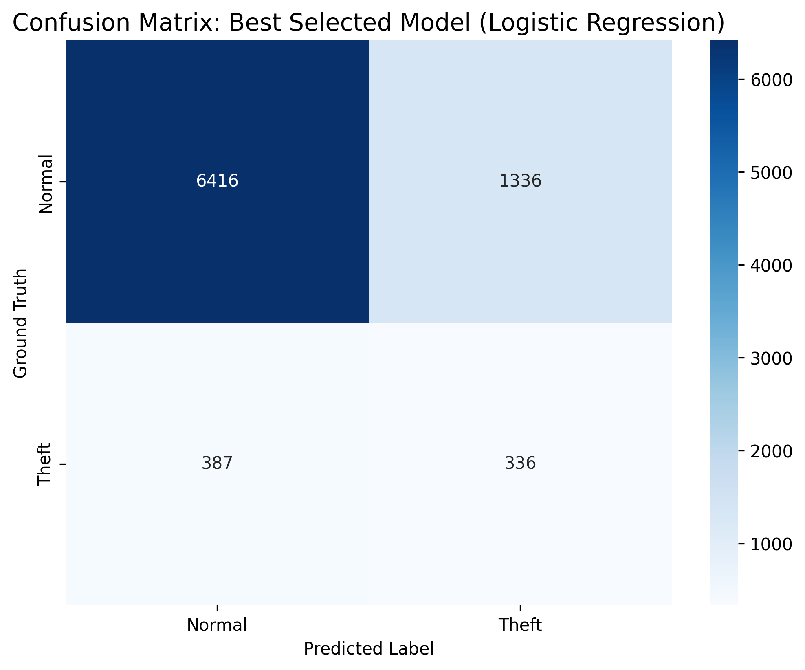
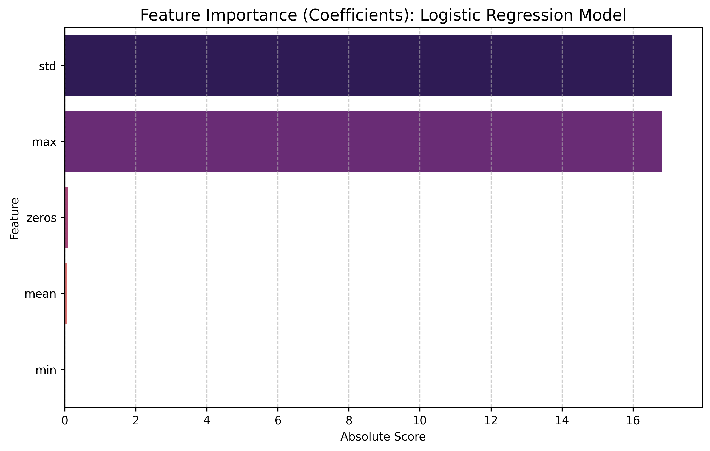
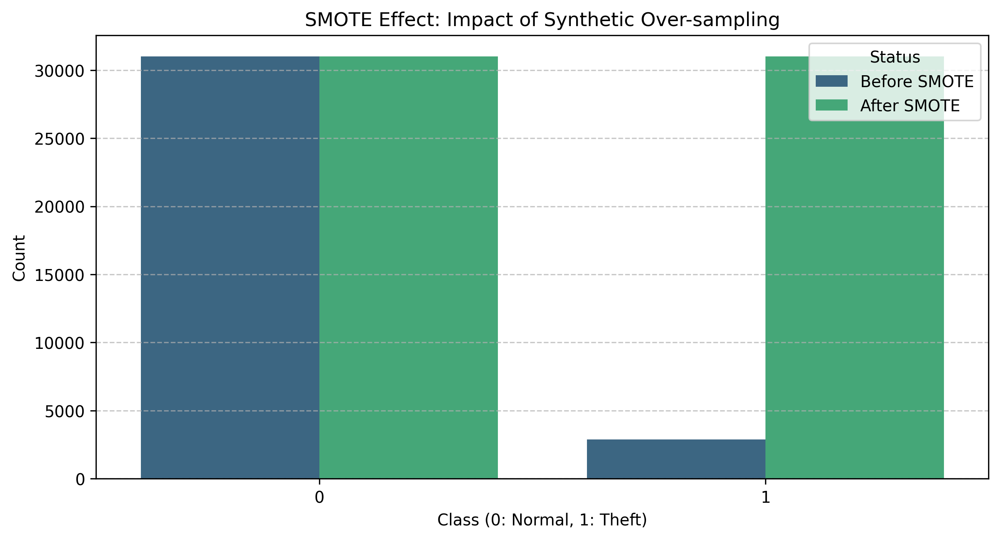

# ⚡ Electricity Theft Detection System

[](https://opensource.org/licenses/MIT)
[](https://www.python.org/)
[](https://flask.palletsprojects.com/)
[](https://scikit-learn.org/)
[](#)

> **Deploying industrial-grade Machine Learning to safeguard smart grid integrity against non-technical losses.**

---

## 📌 Overview

Electricity theft represents a multi-billion dollar challenge for utilities worldwide. This project implements a **comprehensive, end-to-end Machine Learning pipeline** designed to detect anomalous consumption patterns (theft) in smart grid environments.

---

## 📊 Dataset

The system is trained on the **[SGCC Electricity Theft Detection Dataset](https://www.kaggle.com/datasets/madsun/sgcc-electricity-theft-detection-dataset)**, a real-world release by the **State Grid Corporation of China**.

### Dataset Characteristics (Validated):
- **Total Consumers**: 42,372 (Real-world scale)
- **Time Horizon**: 1,035 daily readings (Jan 2014 – Oct 2016)
- **Class Distribution**: ~8.5% Theft / 91.5% Normal
- **Feature Depth**: 1,034 consumption readings per consumer

---

## 🏗️ System Architecture



---

## 🚀 Key Technical Features

### 1. Robust Pipeline Engineering
- **Modular Design**: Individual services for ingestion, transformation, and training.
- **Advanced Preprocessing**: Implementation of recursive statistical feature extraction.
- **Class Balancing**: Integrated **SMOTE** over-sampling to handle severe class imbalance.

### 2. High-Performance Modeling
Utilizing state-of-the-art **CatBoost** and **XGBoost** classifiers optimized for categorical and unbalanced data.

### 3. Modern Inference Portal
A premium web interface built with **Glassmorphism** principles, providing real-time scores.

---

---

## 📊 Model Evaluation & Insights

Comprehensive evaluation metrics and visualizations to ensure transparency and performance validation.

### 1. Model Comparison Analysis
Comparison of primary metrics (Accuracy, F1, Recall, AUC) across all candidate models.


### 2. ROC Curve Separability
IEEE-standard ROC curve comparison showing the trade-off between sensitivity and specificity.


### 3. Confusion Matrix (Best Model)
Detailed breakdown of classification results for the selected best model.


### 4. Feature Importance (Interpretability)
Identifying the most influential factors in detecting electricity theft.


### 5. SMOTE Effect Visualization
Visual proof of balancing the highly skewed class distribution using SMOTE.


---

## 🛠️ Installation & Setup

### 1. Requirements
Ensure you have Python 3.12+ installed. 
```bash
pip install -r requirements.txt
```

### 2. Execution
**Train the Pipeline**:
```bash
python -c "from src.pipeline.train_pipeline import TrainPipeline; TrainPipeline().run()"
```

**Launch the Prediction Portal**:
```bash
python app.py
```

---

## 📂 Project Structure
- `src/components`: Core ML logic (Ingestion, Transformation, Training).
- `src/pipeline`: Execution workflows.
- `notebooks`: High-quality Exploratory Data Analysis.
- `reports`: Automation health reports and diagnostics.
- `templates`: Premium UI assets.

---

## 📜 License
This project is licensed under the **MIT License** - see the [LICENSE](LICENSE) file for details.
